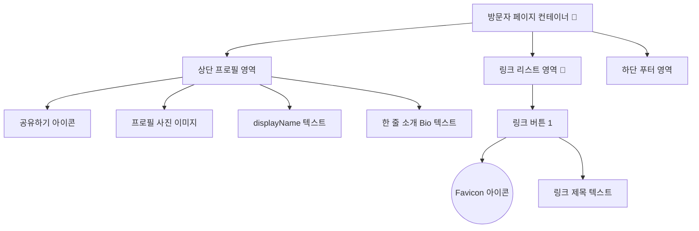
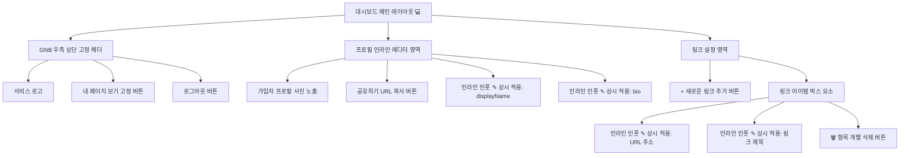

# 마이링크 (MyLink) UI 와이어프레임(Wireframe) 구조도

단순함과 모던함을 지향하는 MVP 디자인 설계에 따라 작성된 시각적 UI 구조입니다.

---

## 1. 방문자 뷰 (퍼블릭 프로필 페이지)
모바일 접속 비율이 압도적으로 높으므로 중앙 정렬 기반 세로형(List) UI를 지향합니다.

### 🖼️ Ascii Art 모바일 레이아웃
```text
+-------------------------------------------------+
|                                                 |
|                                     [공유 🔗]   |
|                                                 |
|               ( 구글 사진 )                     |
|                                                 |
|               @displayName                      |
|         "여기 클릭하여 한 줄 소개 확인"         |
|                                                 |
| ----------------------------------------------- |
|                                                 |
|  [ G ]  내 포트폴리오 (Github)                  |
|                                                 |
|  [ B ]  기술 블로그 (Tistory)                   |
|                                                 |
| ----------------------------------------------- |
|             Powered by MyLink                   |
|                                                 |
+-------------------------------------------------+
* [ ] 안의 영문(G, B)은 Google Favicon API가 불러온 아이콘 로고입니다.
```

### 📊 Mermaid 계층 아키텍처


<br>

---

## 2. 소유자 뷰 (로그인 대시보드 - 관리자 화면)
수정 기능 특화 화면입니다. 우측 상단 고정 버튼으로 상시 퍼블릭 뷰를 확인할 수 있으며, 편집이 가능한 항목 옆에는 항상 연필(✎) 아이콘이 존재하여 "별도의 수정 화면 없이 여기서 바로 수정할 수 있음"을 직관적으로 알립니다.

### 🖼️ Ascii Art 레이아웃
```text
+-------------------------------------------------+
| [MyLink]             [내 페이지 보기👉] [로그아웃]|
+-------------------------------------------------+
|                                                 |
|  [ 내 프로필 설정 ]                             |
|                                                 |
|   ( 구글 사진 )   [내 프로필 주소 노출/복사]    |
|                                                 |
|   이름: [ 닉네임 입력 및 노출 영역     ✎ ]      |
|   소개: [ 한 줄 소개 입력 및 노출 영역 ✎ ]      |
|                                                 |
| ----------------------------------------------- |
|                                                 |
|  [ 내 링크 관리 ]                               |
|                                                 |
|   + 새로운 링크 추가 ⊕                          |
|                                                 |
|   +-----------------------------------------+   |
|   | URL : [ https://...                  ✎ ]|   |
|   | 제목: [ 내 깃허브                    ✎ ]| 🗑️|
|   +-----------------------------------------+   |
|                                                 |
|   +-----------------------------------------+   |
|   | URL : [ https://...                  ✎ ]|   |
|   | 제목: [ 기술 블로그                  ✎ ]| 🗑️|
|   +-----------------------------------------+   |
|                                                 |
+-------------------------------------------------+
* ✎ 연필 아이콘: 관리자 대시보드에서만 상시 노출되며, 마우스 커서를 갖다 대거나 클릭하면 곧장 수정 가능한 폼(<input>) 상태가 됩니다.
* [내 페이지 보기👉] 버튼: 화면 우측 상단 글로벌 헤더에 고정(Sticky)되어 스크롤을 내려도 항상 이동할 수 있습니다.
```

### 📊 Mermaid 계층 아키텍처

